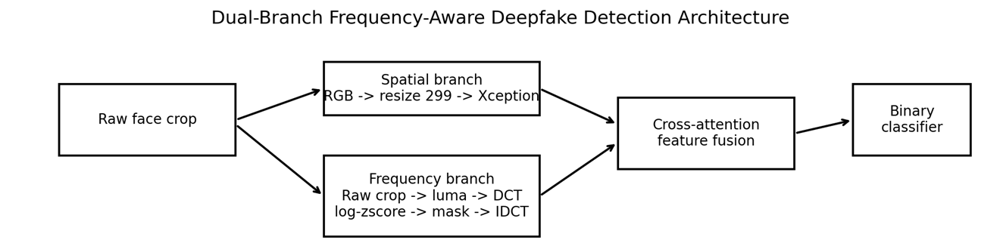
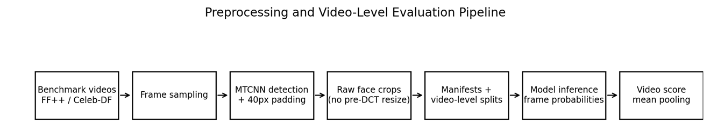
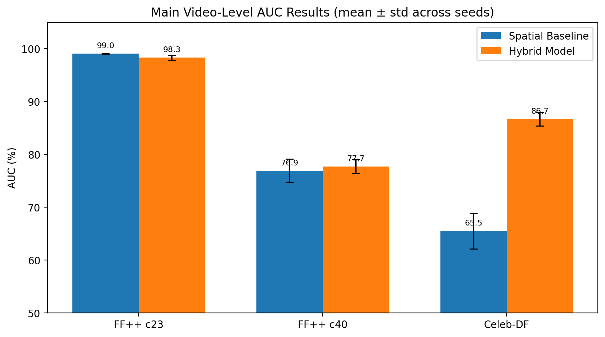
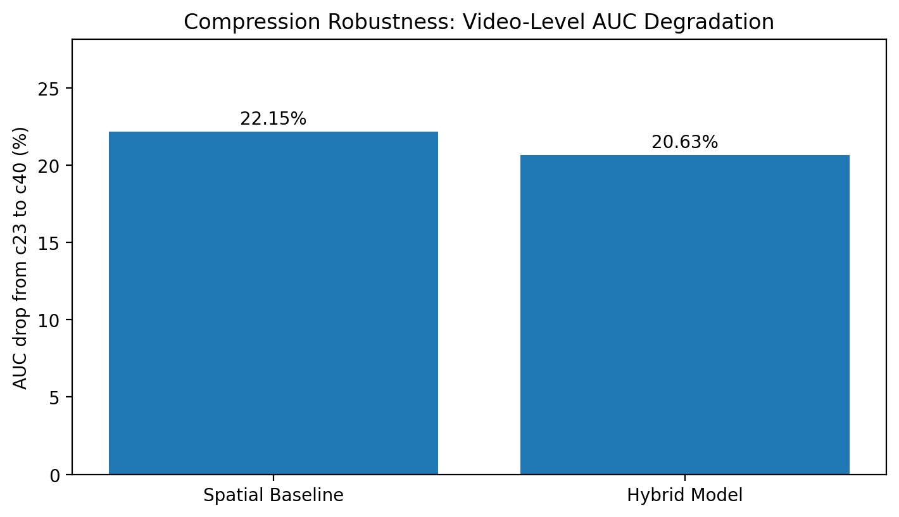
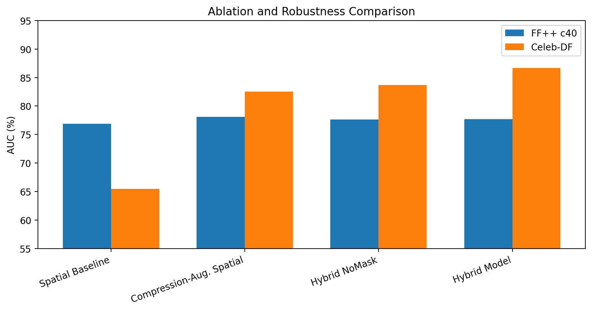
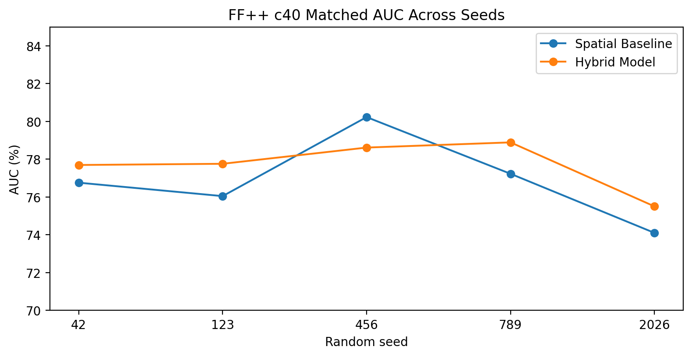
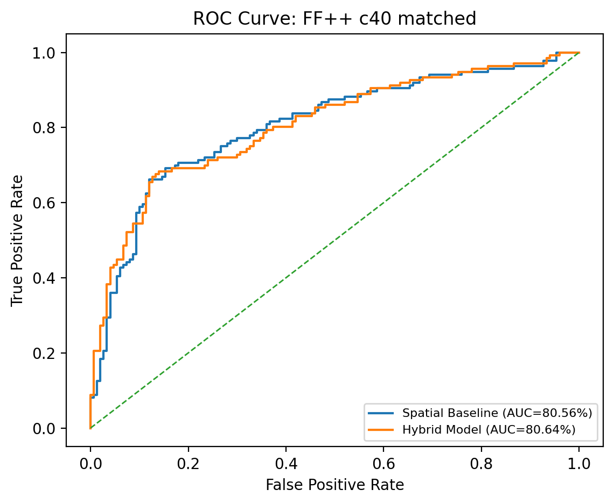
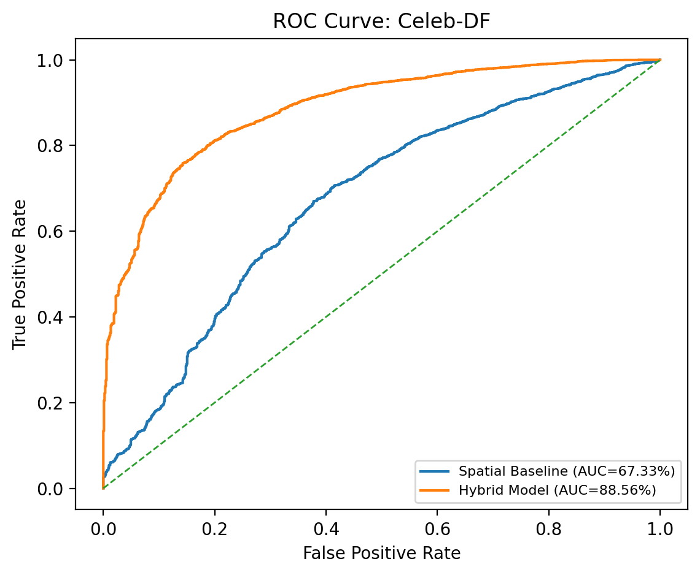
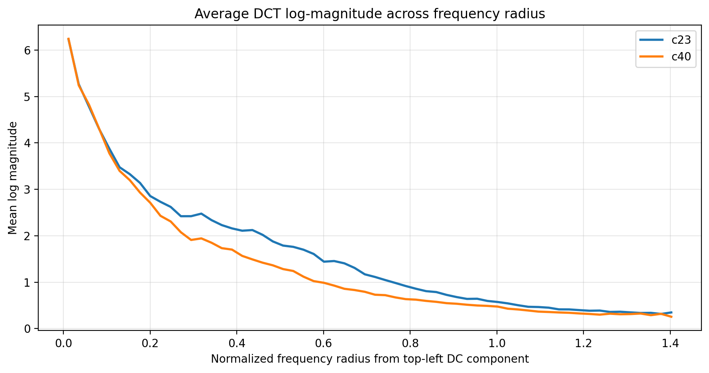

# Frequency-Aware Deepfake Detection under Lossy Compression

Research implementation of a spatial-frequency deepfake detection pipeline under lossy H.264 compression and cross-dataset evaluation.

The project compares a spatial XceptionNet-style baseline with a dual-branch frequency-aware detector that combines RGB spatial features, DCT-based frequency representations, learnable frequency masking, and cross-attention fusion.

## Highlights

- Spatial XceptionNet-style baseline for RGB face crops.
- Frequency-aware dual-branch detector using raw crop DCT features.
- Learnable frequency masking to reduce overfitting to narrow spectral artifacts.
- Cross-attention fusion between spatial and frequency tokens.
- Video-level aggregation and evaluation.
- Controlled compression robustness testing on FF++ c23 and matched FF++ c40.
- External cross-dataset generalization testing on Celeb-DF v2.
- Ablation variants for frequency masking and compression-oriented augmentation.

## Motivation

Deepfake detectors often perform strongly on controlled benchmark data, but real videos are commonly recompressed by social platforms, messaging applications, and streaming services. Lossy compression can remove or distort subtle forensic traces, especially fine spatial artifacts. This repository evaluates whether frequency-domain modeling can provide complementary evidence when spatial cues are weakened by compression or dataset shift.

## Architecture



The implemented pipeline uses two complementary branches:

1. **Spatial branch**: processes RGB face crops resized to 299 × 299 using an XceptionNet-style backbone.
2. **Frequency branch**: converts raw face crops to luma, applies a differentiable 2D DCT, normalizes the log spectrum, applies learnable frequency masking, reconstructs an artifact map with inverse DCT, and encodes it with a CNN.
3. **Fusion module**: uses cross-attention so spatial tokens can attend to frequency cues.
4. **Classifier**: predicts real/fake labels at frame level, then aggregates predictions to video level.

## Processing Pipeline



The preprocessing and evaluation flow is:

```text
Videos -> frame extraction -> MTCNN face detection -> padded face crops -> manifests -> model inference -> video-level aggregation
```

## Implemented Model Modes

| Mode | Purpose |
|---|---|
| `spatial` | RGB-only XceptionNet-style baseline. |
| `dual` | Full frequency-aware hybrid model with DCT branch, learnable mask, and cross-attention fusion. |
| `dual_nomask` | Ablation of the hybrid model without learnable frequency masking. |
| `spatial` + compression augmentation | Spatial ablation with JPEG, blur, and down-up resize augmentation. |

## Evaluation Design

The main models are trained on FaceForensics++ c23 and evaluated using video-level metrics.

| Evaluation setting | Purpose |
|---|---|
| FF++ c23 | In-distribution test under high-quality H.264 compression. |
| FF++ c40 matched | Heavy-compression robustness test using the same matched test identities. |
| Celeb-DF v2 | External cross-dataset generalization test without fine-tuning. |

FF++ c40 is interpreted as a controlled compression-robustness test. Celeb-DF is interpreted as an external generalization test because it differs in dataset distribution, manipulation characteristics, and visual realism.

## Datasets

This project is evaluated on two benchmark datasets widely used in deepfake detection research.

| Dataset | Role |
|---|---|
| FaceForensics++ | Main benchmark for controlled compression evaluation using c23 and c40 H.264 settings. |
| Celeb-DF v2 | External benchmark for cross-dataset generalization without fine-tuning. |

FaceForensics++ c23 is used for training and in-distribution testing. A matched FF++ c40 test split is used to measure robustness under stronger compression. Celeb-DF v2 is used only as an external test set to assess generalization under dataset shift.

## Key Results

| Evaluation setting | Spatial baseline | Frequency-aware hybrid | Observation |
|---|---:|---:|---|
| FF++ c23 Accuracy | 96.78 ± 0.52% | 95.66 ± 0.84% | Spatial cues remain highly effective under high-quality compression. |
| FF++ c23 AUC | 99.03 ± 0.08% | 98.32 ± 0.48% | RGB-only baseline is slightly stronger in-distribution. |
| FF++ c40 Accuracy | 68.88 ± 2.36% | 71.82 ± 1.20% | Hybrid model improves accuracy under heavy compression. |
| FF++ c40 AUC | 76.87 ± 2.22% | 77.69 ± 1.33% | Heavy compression remains the dominant challenge. |
| Celeb-DF AUC | 65.47 ± 3.38% | 86.67 ± 1.29% | Frequency-aware modeling substantially improves external generalization. |



The charts in `docs/figures/` are repository visualizations prepared from the reported experimental results for presentation in this README.

### Compression Robustness



### Ablation and Robustness Comparison



### Seed Stability



### ROC Curves

| FF++ c40 matched | Celeb-DF |
|---|---|
|  |  |

### Frequency-Domain Analysis



## Main Findings

1. **Spatial features remain very strong under FF++ c23.**  
   The spatial baseline slightly outperforms the hybrid model in the in-distribution c23 setting.

2. **Heavy H.264 compression degrades both models.**  
   FF++ c40 causes a large drop in both AUC and accuracy, showing that compression is a major robustness challenge.

3. **Frequency-aware modeling helps most under dataset shift.**  
   The largest improvement appears on Celeb-DF, suggesting that DCT-based frequency cues improve external generalization more than they fully recover information lost under severe compression.

4. **The hybrid model is complementary, not universally superior.**  
   The frequency-aware branch improves robustness and generalization in specific conditions, while the spatial baseline remains highly competitive when spatial artifacts are preserved.

## Repository Structure

```text
.
├── dataset.py                 # Dataset loading, spatial transforms, and padded batching
├── evaluate.py                # Inference, frame metrics, video aggregation, and CSV output
├── metrics.py                 # Accuracy, balanced accuracy, ROC-AUC, PR-AUC, precision, recall, F1
├── model.py                   # Spatial baseline, DCT branch, frequency mask, cross-attention fusion
├── preprocessing.py           # Frame extraction, face detection, crop filtering, manifest generation
├── prepare_splits.py          # Video-level split preparation utilities
├── train.py                   # Training, checkpointing, validation thresholding, early stopping
├── requirements.txt           # Python dependencies
├── docs/
│   └── figures/               # Architecture and result figures used in this README
└── README.md
```

## Installation

### Windows PowerShell

```powershell
git clone https://github.com/AlAsiri-Ali/frequency-aware-deepfake-detection.git
cd frequency-aware-deepfake-detection
py -3.10 -m venv .venv
.\.venv\Scripts\Activate.ps1
python -m pip install --upgrade pip
pip install -r requirements.txt
```

If PowerShell blocks activation, run:

```powershell
Set-ExecutionPolicy -ExecutionPolicy RemoteSigned -Scope CurrentUser
```

Then activate the environment again.

### Linux / macOS

```bash
git clone https://github.com/AlAsiri-Ali/frequency-aware-deepfake-detection.git
cd frequency-aware-deepfake-detection
python3 -m venv .venv
source .venv/bin/activate
python -m pip install --upgrade pip
pip install -r requirements.txt
```

### CUDA / CPU

The scripts default to CUDA when it is available. Use CPU explicitly if needed:

```bash
--device cpu
```

Training on CPU is expected to be slow. For GPU experiments, install a PyTorch build that matches your CUDA version.

## Command Style Across Operating Systems

The paths in the examples use forward slashes, such as:

```text
data/processed/ffpp/c23/train/manifest.csv
```

This is intentional. Python and `pathlib` accept forward-slash paths on Windows, Linux, and macOS.

The shell-specific part is only the line continuation character:

| Shell | Line continuation |
|---|---|
| Windows PowerShell | Backtick: `` ` `` |
| Windows Command Prompt | Caret: `^` |
| Linux/macOS Bash or zsh | Backslash: `\` |

To avoid shell issues, the training and evaluation commands below are written as **portable one-line commands**. They work in PowerShell, Command Prompt, Bash, and zsh as long as Python and the environment are configured correctly.

## Data and Manifest Layout

The repository expects locally prepared datasets and manifests consistent with the official access terms of FaceForensics++ and Celeb-DF.

Expected manifest locations used by the examples:

```text
data/processed/ffpp/c23/train/manifest.csv
data/processed/ffpp/c23/val/manifest.csv
data/processed/ffpp/c23/test/manifest.csv
audit_reports/ffpp_c40_test_matched_to_c23_test_manifest.csv
data/processed/celebdf/raw/test/manifest.csv
```

Minimum manifest columns:

```text
image_path,label
```

Recommended manifest columns for video-level evaluation:

```text
image_path,source_video_path,label,video_id,dataset,compression,split,width,height,frame_idx
```

Labels:

```text
0 = real
1 = fake
```

`video_id` is important for correct video-level aggregation. Crops from the same video should share the same `video_id`.

## Preprocessing

Example:

```bash
python preprocessing.py --dataset ffpp --input-root data/raw/ffpp/c23 --output-root data/processed/ffpp/c23 --compression c23 --split train --device cuda --padding 40 --min-face-size 50 --min-conf 0.80 --manifest-name manifest.csv
```

For Windows systems without stable multiprocessing, keep `--num-workers 0` during training and evaluation.

## Training

### Spatial Baseline

The spatial baseline uses RGB face crops with standard flip and brightness/contrast augmentation only. JPEG, blur, and resize augmentation are disabled in this command to keep the baseline clean.

```bash
python train.py --train-manifest data/processed/ffpp/c23/train/manifest.csv --val-manifest data/processed/ffpp/c23/val/manifest.csv --output-dir runs/spatial_seed42 --model-type spatial --epochs 20 --batch-size 8 --num-workers 0 --device cuda --seed 42 --jpeg-prob 0 --blur-prob 0 --resize-prob 0 --save-last-every-epoch
```

### Dual Frequency-Aware Model

```bash
python train.py --train-manifest data/processed/ffpp/c23/train/manifest.csv --val-manifest data/processed/ffpp/c23/val/manifest.csv --output-dir runs/dual_seed42 --model-type dual --epochs 20 --batch-size 8 --num-workers 0 --device cuda --seed 42 --save-last-every-epoch
```

### Hybrid No-Mask Ablation

```bash
python train.py --train-manifest data/processed/ffpp/c23/train/manifest.csv --val-manifest data/processed/ffpp/c23/val/manifest.csv --output-dir runs/dual_nomask_seed42 --model-type dual_nomask --epochs 20 --batch-size 8 --num-workers 0 --device cuda --seed 42 --save-last-every-epoch
```

### Compression-Augmented Spatial Baseline

This variant tests whether compression-like augmentation alone improves robustness.

```bash
python train.py --train-manifest data/processed/ffpp/c23/train/manifest.csv --val-manifest data/processed/ffpp/c23/val/manifest.csv --output-dir runs/spatial_aug_seed42 --model-type spatial --epochs 20 --batch-size 8 --num-workers 0 --device cuda --seed 42 --jpeg-prob 0.3 --blur-prob 0.3 --resize-prob 0.3 --save-last-every-epoch
```

### Optional Multi-Line Examples

PowerShell format:

```powershell
python train.py `
  --train-manifest data/processed/ffpp/c23/train/manifest.csv `
  --val-manifest data/processed/ffpp/c23/val/manifest.csv `
  --output-dir runs/dual_seed42 `
  --model-type dual `
  --epochs 20 `
  --batch-size 8 `
  --num-workers 0 `
  --device cuda `
  --seed 42 `
  --save-last-every-epoch
```

Linux/macOS Bash format:

```bash
python train.py \
  --train-manifest data/processed/ffpp/c23/train/manifest.csv \
  --val-manifest data/processed/ffpp/c23/val/manifest.csv \
  --output-dir runs/dual_seed42 \
  --model-type dual \
  --epochs 20 \
  --batch-size 8 \
  --num-workers 0 \
  --device cuda \
  --seed 42 \
  --save-last-every-epoch
```

## Evaluation

### Evaluate Dual Frequency-Aware Model

FF++ c23:

```bash
python evaluate.py --checkpoint runs/dual_seed42/best.pt --test-manifest data/processed/ffpp/c23/test/manifest.csv --dataset-name ffpp_c23 --model-type dual --predictions-csv outputs/dual_seed42/ffpp_c23.csv --num-workers 0 --batch-size 16 --device cuda
```

FF++ c40 matched:

```bash
python evaluate.py --checkpoint runs/dual_seed42/best.pt --test-manifest audit_reports/ffpp_c40_test_matched_to_c23_test_manifest.csv --dataset-name ffpp_c40_matched --model-type dual --predictions-csv outputs/dual_seed42/ffpp_c40_matched.csv --num-workers 0 --batch-size 16 --device cuda
```

Celeb-DF:

```bash
python evaluate.py --checkpoint runs/dual_seed42/best.pt --test-manifest data/processed/celebdf/raw/test/manifest.csv --dataset-name celebdf --model-type dual --predictions-csv outputs/dual_seed42/celebdf.csv --num-workers 0 --batch-size 16 --device cuda
```

### Evaluate Spatial Baseline

FF++ c23:

```bash
python evaluate.py --checkpoint runs/spatial_seed42/best.pt --test-manifest data/processed/ffpp/c23/test/manifest.csv --dataset-name ffpp_c23 --model-type spatial --predictions-csv outputs/spatial_seed42/ffpp_c23.csv --num-workers 0 --batch-size 16 --device cuda
```

FF++ c40 matched:

```bash
python evaluate.py --checkpoint runs/spatial_seed42/best.pt --test-manifest audit_reports/ffpp_c40_test_matched_to_c23_test_manifest.csv --dataset-name ffpp_c40_matched --model-type spatial --predictions-csv outputs/spatial_seed42/ffpp_c40_matched.csv --num-workers 0 --batch-size 16 --device cuda
```

Celeb-DF:

```bash
python evaluate.py --checkpoint runs/spatial_seed42/best.pt --test-manifest data/processed/celebdf/raw/test/manifest.csv --dataset-name celebdf --model-type spatial --predictions-csv outputs/spatial_seed42/celebdf.csv --num-workers 0 --batch-size 16 --device cuda
```

### Evaluate Ablation Variants

Hybrid NoMask on FF++ c40:

```bash
python evaluate.py --checkpoint runs/dual_nomask_seed42/best.pt --test-manifest audit_reports/ffpp_c40_test_matched_to_c23_test_manifest.csv --dataset-name ffpp_c40_matched --model-type dual_nomask --predictions-csv outputs/dual_nomask_seed42/ffpp_c40_matched.csv --num-workers 0 --batch-size 16 --device cuda
```

Compression-augmented spatial model on FF++ c40:

```bash
python evaluate.py --checkpoint runs/spatial_aug_seed42/best.pt --test-manifest audit_reports/ffpp_c40_test_matched_to_c23_test_manifest.csv --dataset-name ffpp_c40_matched --model-type spatial --predictions-csv outputs/spatial_aug_seed42/ffpp_c40_matched.csv --num-workers 0 --batch-size 16 --device cuda
```

## Multi-Seed Experiments

Recommended seeds:

```text
42, 123, 456, 789, 2026
```

Run the same train/evaluate commands for each seed and report:

```text
mean ± standard deviation
```

## Metrics

The evaluation script reports frame-level and video-level metrics:

- Accuracy
- Balanced accuracy
- ROC-AUC
- PR-AUC / Average Precision
- Precision
- Recall
- F1-score

Final comparisons should prioritize video-level metrics because the target decision is a video-level real/fake prediction.

## Reproducibility Notes

- Split FF++ data at the source-video level.
- Keep all frames from a source video within the same split to prevent leakage.
- Use the matched FF++ c40 manifest when comparing c23 and c40 results.
- Treat Celeb-DF as an external test set unless explicitly running fine-tuning experiments.
- On Windows, `--num-workers 0` is a stable default for DataLoader execution.

## Reference Environment

| Item | Setting |
|---|---|
| Python | 3.10.11 |
| PyTorch | 2.7.1 + CUDA 11.8 runtime |
| GPU | NVIDIA RTX 4070 Ti, 12 GB VRAM |
| CPU / RAM | Intel i7-14700KF, 32 GB RAM |
| OS | Windows 11 64-bit |
| Batch size | 8 for training, 16 for evaluation |
| DataLoader workers | 0 |

The code can run on other environments, but runtime and CUDA installation steps may differ.


## Acknowledgments

This implementation builds on widely used open-source tools and research resources for computer vision and deepfake detection, including PyTorch, timm, facenet-pytorch, OpenCV, FaceForensics++, and Celeb-DF.

## Ethical Use

This repository is intended for defensive research in deepfake detection and digital media forensics. Use datasets and model outputs responsibly and follow the license terms of the original datasets.
